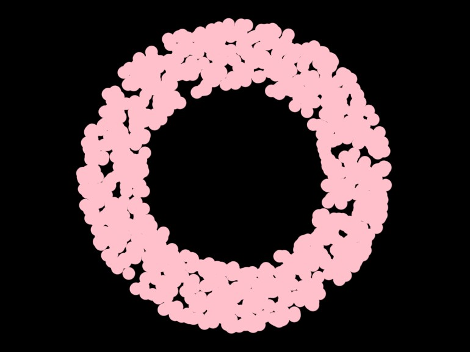
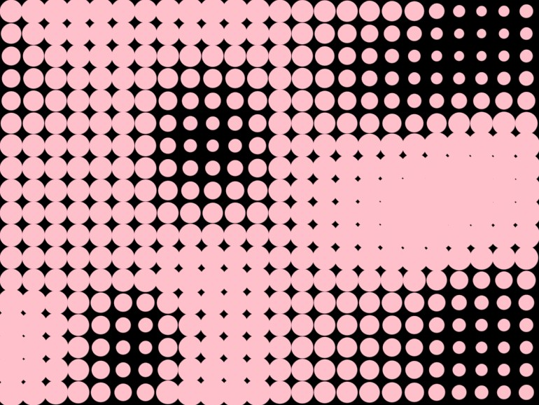
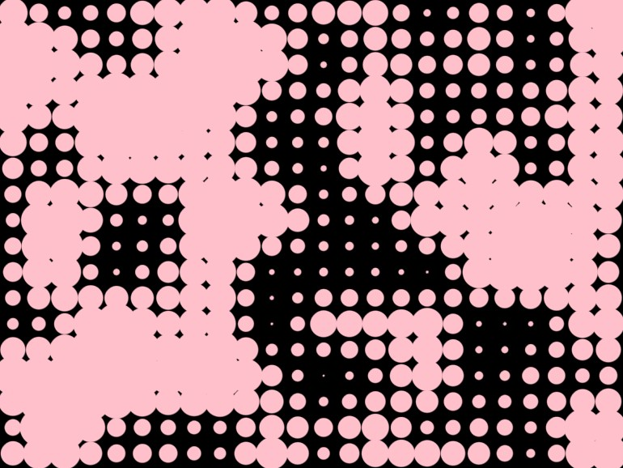
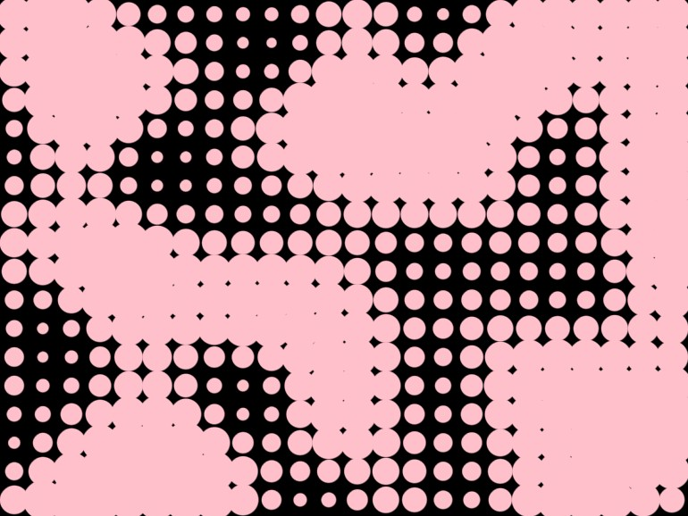

---
# File generated by dokgen. Do not edit. 
# Edit 'src/main/kotlin/docs/80_ORX/C110_Noise.kt' instead.
layout: default
title: Noise
parent: ORX
last_modified_at: 2025.08.02 12:19:06 +0000
nav_order: 110
has_children: false
---
 
# orx-noise

A collection of noise generator functions. Source and extra 
documentation can be found in the 
[orx-noise sourcetree](https://github.com/openrndr/orx/tree/master/orx-noise).

## Prerequisites

Assuming you are working on an 
[`openrndr-template`](https://github.com/openrndr/openrndr-template) based
project, all you have to do is enable `orx-noise` in the `orxFeatures`
set in `build.gradle.kts` and reimport the gradle project.

## Uniformly distributed random values

The library provides extension methods for `Double`, `Vector2`, `Vector3`, 
`Vector4` to create random vectors easily. To create
scalars and vectors with uniformly distributed noise you use the 
`uniform` extension function. 
 
```kotlin
val d1 = Double.uniform(0.0, 640.0)
val v2 = Vector2.uniform(0.0, 640.0)
val v3 = Vector3.uniform(0.0, 640.0)
val v4 = Vector4.uniform(0.0, 640.0)
``` 
 
To create multiple samples of noise one uses the `uniforms` function. 
 
```kotlin
val v2 = Vector2.uniforms(100, Vector2(0.0, 0.0), Vector2(640.0, 640.0))
val v3 = Vector3.uniforms(100, Vector3(0.0, 0.0, 0.0), Vector3(640.0, 640.0, 640.0))
``` 
 
The `Random` class can also be used to generate Double numbers and vector,
but also booleans and integers. 
 
```kotlin
// Boolean
val b = Random.bool(probability = 0.2)

// Int
val i1 = Random.int(0, 640)
val i2 = Random.int0(640)

// Double
val d2 = Random.double(0.0, 640.0)
val d3 = Random.double0(640.0)

// Vectors
val v2 = Random.vector2(0.0, 640.0)
val v3 = Random.vector3(0.0, 640.0)
val v4 = Random.vector4(0.0, 640.0)
``` 
 
## Perlin, Value and Simplex noise

`Random.perlin()` and `Random.value()` 
accept 2D and 3D arguments. 
`Random.simplex()` up to 4D.
They all return a `Double`.
Some examples: 
 
```kotlin
// Test vectors to use
val v2 = Vector2(0.1, 0.2)
val v4 = Vector4(0.1, 0.2, 0.3, 0.4)

// Now generate random values
val d1 = Random.perlin(0.1, 0.2)
val d2 = Random.perlin(v2)
val d3 = Random.value(0.1, 0.2, 0.3)
val d4 = Random.simplex(v4)
``` 
 
## Uniform ring noise 
 
```kotlin
val v2 = Vector2.uniformRing(0.0, 300.0)
val v3 = Vector3.uniformRing(0.0, 300.0)
val v4 = Vector4.uniformRing(0.0, 300.0)
``` 
 
 
 
```kotlin
fun main() = application {
    program {
        extend {
            drawer.fill = ColorRGBa.PINK
            drawer.stroke = null
            drawer.translate(width / 2.0, height / 2.00)
            for (i in 0 until 1000) {
                drawer.circle(Vector2.uniformRing(150.0, 250.0), 10.0)
            }
        }
    }
}
``` 
 
[Link to the full example](https://github.com/openrndr/openrndr-examples/blob/master/src/main/kotlin/examples/80_ORX/C110_Noise000.kt) 
 
## Perlin noise 
 
 
 
```kotlin
fun main() = application {
    program {
        extend {
            drawer.fill = ColorRGBa.PINK
            drawer.stroke = null
            val scale = 0.005
            for (y in 16 until height step 32) {
                for (x in 16 until width step 32) {
                    val radius = perlinLinear(100, x * scale, y * scale) * 16.0 + 16.0
                    drawer.circle(x * 1.0, y * 1.0, radius)
                }
            }
        }
    }
}
``` 
 
[Link to the full example](https://github.com/openrndr/openrndr-examples/blob/master/src/main/kotlin/examples/80_ORX/C110_Noise001.kt) 
 
## Value noise 
 
 
 
```kotlin
fun main() = application {
    program {
        extend {
            drawer.fill = ColorRGBa.PINK
            drawer.stroke = null
            val scale = 0.0150
            for (y in 16 until height step 32) {
                for (x in 16 until width step 32) {
                    val radius = valueLinear(100, x * scale, y * scale) * 16.0 + 16.0
                    drawer.circle(x * 1.0, y * 1.0, radius)
                }
            }
        }
    }
}
``` 
 
[Link to the full example](https://github.com/openrndr/openrndr-examples/blob/master/src/main/kotlin/examples/80_ORX/C110_Noise002.kt) 
 
## Simplex noise 
 
 
 
```kotlin
fun main() = application {
    program {
        extend {
            drawer.fill = ColorRGBa.PINK
            drawer.stroke = null
            val scale = 0.004
            for (y in 16 until height step 32) {
                for (x in 16 until width step 32) {
                    val radius = simplex(100, x * scale, y * scale) * 16.0 + 16.0
                    drawer.circle(x * 1.0, y * 1.0, radius)
                }
            }
        }
    }
}
``` 
 
[Link to the full example](https://github.com/openrndr/openrndr-examples/blob/master/src/main/kotlin/examples/80_ORX/C110_Noise003.kt) 
 
## Fractal/FBM noise 
 
<video controls preload="none" loop poster="../media/orx-noise-005-fbm-thumb.jpg">
    <source src="../media/orx-noise-005-fbm.mp4" type="video/mp4">
</video>
 
 
```kotlin
fun main() = application {
    program {
        extend {
            drawer.fill = ColorRGBa.PINK
            drawer.stroke = null
            val s = 0.0080
            val t = seconds
            for (y in 4 until height step 8) {
                for (x in 4 until width step 8) {
                    val radius = when {
                        t < 3.0 -> abs(fbm(100, x * s, y * s, t, ::perlinLinear)) * 16.0
                        t < 6.0 -> billow(100, x * s, y * s, t, ::perlinLinear) * 2.0
                        else -> rigid(100, x * s, y * s, t, ::perlinLinear) * 16.0
                    }
                    drawer.circle(x * 1.0, y * 1.0, radius)
                }
            }
        }
    }
}
``` 
 
[Link to the full example](https://github.com/openrndr/openrndr-examples/blob/master/src/main/kotlin/examples/80_ORX/C110_Noise004.kt) 
 
## Noise gradients

Noise functions have evaluable gradients, a direction to where the 
value of the function increases the fastest. The `gradient1D`, 
`gradient2D`, `gradient3D` and `gradient4D` functions can be used 
to estimate gradients for noise functions. 
 
<video controls preload="none" loop poster="../media/orx-noise-300-thumb.jpg">
    <source src="../media/orx-noise-300.mp4" type="video/mp4">
</video>
 
 
```kotlin
fun main() = application {
    program {
        extend {
            drawer.fill = null
            drawer.stroke = ColorRGBa.PINK
            drawer.lineCap = LineCap.ROUND
            drawer.strokeWeight = 3.0
            val t = seconds
            for (y in 4 until height step 8) {
                for (x in 4 until width step 8) {
                    val g = gradient3D(::perlinQuintic, 100, x * 0.005, y * 0.005, t, 0.0005).xy
                    drawer.lineSegment(Vector2(x * 1.0, y * 1.0) - g * 2.0, Vector2(x * 1.0, y * 1.0) + g * 2.0)
                }
            }
        }
    }
}
``` 
 
[Link to the full example](https://github.com/openrndr/openrndr-examples/blob/master/src/main/kotlin/examples/80_ORX/C110_Noise005.kt) 
 
Gradients can also be calculated for the fbm, rigid and billow versions 
of the noise functions. However, 
we first have to create a function that can be used by the gradient 
estimator. For this `fbmFunc3D`, `billowFunc3D`, and 
`rigidFunc3D` can be used (which works through 
[partial application](https://en.wikipedia.org/wiki/Partial_application)). 
 
<video controls preload="none" loop poster="../media/orx-noise-301-thumb.jpg">
    <source src="../media/orx-noise-301.mp4" type="video/mp4">
</video>
 
 
```kotlin
fun main() = application {
    program {
        val noise = fbmFunc3D(::simplex, octaves = 3)
        extend {
            drawer.fill = null
            drawer.stroke = ColorRGBa.PINK
            drawer.lineCap = LineCap.ROUND
            drawer.strokeWeight = 1.5
            val t = seconds
            for (y in 4 until height step 8) {
                for (x in 4 until width step 8) {
                    val g = gradient3D(noise, 100, x * 0.002, y * 0.002, t, 0.002).xy
                    drawer.lineSegment(Vector2(x * 1.0, y * 1.0) - g * 1.0, Vector2(x * 1.0, y * 1.0) + g * 1.0)
                }
            }
        }
    }
}
``` 
 
[Link to the full example](https://github.com/openrndr/openrndr-examples/blob/master/src/main/kotlin/examples/80_ORX/C110_Noise006.kt) 

[edit on GitHub](https://github.com/openrndr/openrndr-guide/blob/main/src/main/kotlin/docs/80_ORX/C110_Noise.kt){: .btn .btn-github }