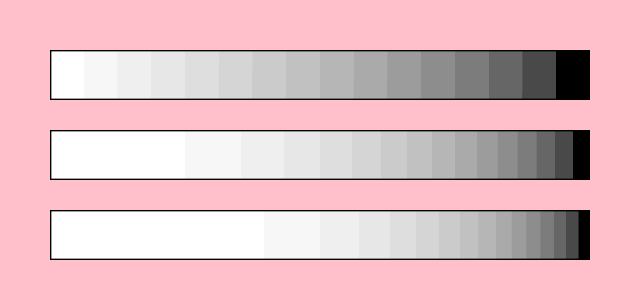
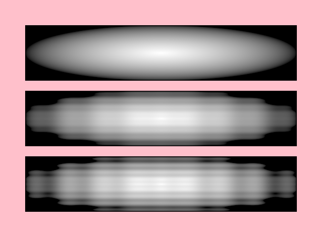

---
# File generated by dokgen. Do not edit. 
# Edit 'src/main/kotlin/docs/80_ORX/C190_Shade_style_presets.kt' instead.
layout: default
title: Shade style presets
parent: ORX
last_modified_at: 2026.09.17 10:37:29 +0000
nav_order: 190
has_children: false
---
 
# Shade style presets

The `orx-shade-styles` library provides a number of preset 
[shade styles](https://guide.openrndr.org/drawing/shadeStyles.html)

## Prerequisites

If you are working on an 
[`openrndr-template`](https://github.com/openrndr/openrndr-template) based
project, `orx-shade-styles` should be ready to use because it is part of the basic
orx bundle, as described in [ORX](/ORX/).

## Linear gradient

The `gradient` shade style constructor is a powerful generator for gradients. In the background it produces GLSL
code that runs in the GPU. It accepts an arbitrary number of colors between `stops[0.0]` and `stops[1.0]`. 
 
<video controls preload="none" loop poster="../media/shade-style-presets-001-thumb.jpg">
    <source src="../media/shade-style-presets-001.mp4" type="video/mp4">
</video>
 
 
```kotlin
fun main() = application {
    program {
        val image = loadImage("data/images/cheeta.jpg")
        val font = loadFont("data/fonts/default.otf", 144.0)
        extend {
            drawer.shadeStyle = gradient<ColorRGBa> {
                stops[0.0] = ColorRGBa.PINK
                stops[0.8] = ColorRGBa.ORANGE
                stops[1.0] = ColorRGBa.RED
                linear {
                    start = Polar(seconds * 60.0, 0.5).cartesian + 0.5
                    end = Polar(seconds * 60.0 + 180.0, 0.5).cartesian + 0.5
                }
            }
            drawer.rectangle(80.0, 40.0, 200.0, 200.0)
            drawer.circle(180.0, 340.0, 90.0)
            drawer.image(image, 300.0, 40.0, 640 * (200 / 480.0), 200.0)
            drawer.fontMap = font
            drawer.text("OPEN", 300.0, 340.0)
            drawer.text("RNDR", 300.0, 420.0)
        }
    }
}
``` 
 
[Link to the full example](https://github.com/openrndr/openrndr-examples/blob/master/src/main/kotlin/examples/80_ORX/C190_Shade_style_presets000.kt) 
 
## Radial gradient

Radial gradients blend colors based on the distance to a center point.
In this example the center point's `x` and `y` coordinates are animated using the sine and cosine of time. 
 
<video controls preload="none" loop poster="../media/shade-style-presets-002-thumb.jpg">
    <source src="../media/shade-style-presets-002.mp4" type="video/mp4">
</video>
 
 
```kotlin
drawer.shadeStyle = gradient<ColorRGBa> {
    stops[0.0] = ColorRGBa.PINK
    stops[1.0] = ColorRGBa.RED
    radial {
        radius = 0.5
        center = Vector2(cos(seconds), sin(seconds * 2.0)) * 0.5 + 0.5
    }
}
``` 
 
[Link to the full example](https://github.com/openrndr/openrndr-examples/blob/master/src/main/kotlin/examples/80_ORX/C190_Shade_style_presets001.kt) 
 
## Conic gradient

Here we can see that `ColorOKLABa` is also supported by the `gradient`
generator. 
 
<video controls preload="none" loop poster="../media/shade-style-presets-003-thumb.jpg">
    <source src="../media/shade-style-presets-003.mp4" type="video/mp4">
</video>
 
 
```kotlin
drawer.shadeStyle = gradient<ColorOKLABa> {
    stops[0.0] = ColorRGBa.PINK.toOKLABa()
    stops[1.0] = ColorRGBa.PURPLE.toOKLABa()
    conic {
        rotation = seconds * 60.0
    }
}
``` 
 
[Link to the full example](https://github.com/openrndr/openrndr-examples/blob/master/src/main/kotlin/examples/80_ORX/C190_Shade_style_presets002.kt) 
 
## Mirrored conic gradient

Here we increase the angle to 720.0 and use `SpreadMethod.REFLECT` to mirror the gradient. 
 
<video controls preload="none" loop poster="../media/shade-style-presets-004-thumb.jpg">
    <source src="../media/shade-style-presets-004.mp4" type="video/mp4">
</video>
 
 
```kotlin
drawer.shadeStyle = gradient<ColorRGBa> {
    stops[0.0] = ColorRGBa.PINK
    stops[1.0] = ColorRGBa.RED
    spreadMethod = SpreadMethod.REFLECT
    conic {
        angle = 360.0 * 2
        rotation = seconds * 60.0
    }
}
``` 
 
[Link to the full example](https://github.com/openrndr/openrndr-examples/blob/master/src/main/kotlin/examples/80_ORX/C190_Shade_style_presets003.kt) 
 
## Quantize and levelWarpFunction

This program demonstrates two more `gradient` features. The first one is `quantization`, which lets us define
how many discrete colors we want our gradient to have.

The second new feature is an advanced one: `levelWarpFunction` lets us inject custom GLSL code into our shader
to modify the gradient level based on the default level, on the pixel's coordinates, or both.
We apply here a very simple adjustment, to elevate the level to a power of 1.0, 2.0 or 3.0, which skews the
balance between white and black.

When using `levelWarpFunction`, provide a string formatted like this: 
`float levelWarp(vec2 p, float level) { return ___; }` where `___` evaluates to a float, typically 
based in the `p` and/or `level` arguments.     
 
 
 
```kotlin
fun main() = application {
    program {
        extend {
            drawer.clear(ColorRGBa.PINK)
            repeat(3) {
                val e = it + 1.0
                drawer.shadeStyle = gradient<ColorRGBa> {
                    stops[0.0] = ColorRGBa.WHITE
                    stops[1.0] = ColorRGBa.BLACK
                    quantization = 16
                    levelWarpFunction = "float levelWarp(vec2 p, float level) { return pow(level, $e); }"
                    linear { }
                }
                drawer.rectangle(50.0, 50.0 + it * 80.0, width - 100.0, 50.0)
            }
        }
    }
}
``` 
 
[Link to the full example](https://github.com/openrndr/openrndr-examples/blob/master/src/main/kotlin/examples/80_ORX/C190_Shade_style_presets004.kt) 
 
## domainWarpFunction

One more advanced feature available to us is `domainWarpFunction`, which lets us inject custom GLSL code into our shader
to distort the gradient calculations based on the pixel's coordinates.

When using `levelWarpFunction`, provide a string formatted like this: 
`vec2 domainWarp(vec2 coord) { return ___; }` where `___` evaluates to a vec2 based on the input `coord`. 
 
 
 
```kotlin
fun main() = application {
    program {
        extend {
            drawer.clear(ColorRGBa.PINK)
            repeat(3) {
                val e = it * 0.02
                drawer.shadeStyle = gradient<ColorRGBa> {
                    stops[0.0] = ColorRGBa.WHITE
                    stops[1.0] = ColorRGBa.BLACK
                    domainWarpFunction = "vec2 domainWarp(vec2 p) { return p + sin(p * 50.0) * $e; }"
                    radial { }
                }
                drawer.rectangle(50.0, 50.0 + it * 130.0, width - 100.0, 110.0)
            }
        }
    }
}
``` 
 
[Link to the full example](https://github.com/openrndr/openrndr-examples/blob/master/src/main/kotlin/examples/80_ORX/C190_Shade_style_presets005.kt) 
 
For more examples, explore the available 
[gradient demos](https://github.com/openrndr/orx/tree/master/orx-shade-styles/src/jvmDemo/kotlin/gradients).  

[edit on GitHub](https://github.com/openrndr/openrndr-guide/blob/main/src/main/kotlin/docs/80_ORX/C190_Shade_style_presets.kt){: .btn .btn-github }