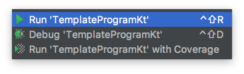
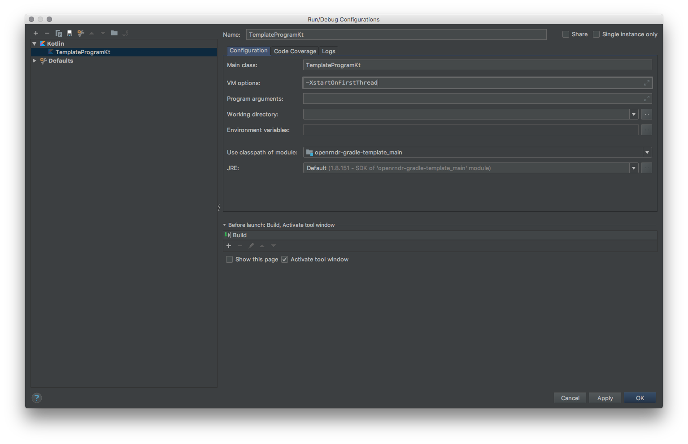

# Getting Started with OPENRNDR #

OPENRNDR provides an application framework that allows its users to write applications that run on Microsoft Windows and MacOS platforms. For future versions we want to include Desktop Linux, Android and Raspberry PI platforms as well.

## Requirements ##
 * A computer running Windows 10 (older versions may work but are untested) or MacOSX 10.10+
 * A graphics adapter and drivers that support OpenGL 3.3
 * Java 8, 9 or 10 JDK installed. Both OpenJDK and OracleJDK work.
 * [IntelliJ Idea 2018.2](https://www.jetbrains.com/idea/download/) Community or Enterprise edition
 * Some experience with the [Kotlin programming language](https://kotlinlang.org)
 * Some experience with [Git](https://git-scm.com/)

## Setting up prerequisites
Before you start working with OPENRNDR please follow these instructions.
 * Install a Java Development KIT (JDK) [OracleJDK 10](http://www.oracle.com/technetwork/java/javase/downloads/jdk10-downloads-4416644.html), or if you prefer a guaranteed free version [OpenJDK 10](http://jdk.java.net/10/) and install it.
 * Download [IntelliJ Idea Community Edition](https://www.jetbrains.com/idea/download) and install it.

## Getting OPENRNDR

OPENRNDR is obtained by adding the OPENRNDR dependencies to your Gradle project. We offer [ready-to-use artifacts](http://dl.bintray.com/openrndr/openrndr/org/openrndr/) through Bintray.

## Writing your first OPENRNDR program

The easiest way to start a new project is to start from the provided [template project](https://github.com/openrndr/openrndr-gradle-template)
```sh
git clone --depth 1 https://github.com/openrndr/openrndr-gradle-template.git
```

This contains everything needed to start, notably the `build.gradle` with the right dependencies, the Gradle wrappers and a very simple OPENRNDR program.

### Importing the template project into IntelliJ Idea

Use VCS -> Checkout from Version Control -> Git to open the "Clone Repository" dialog.


Fill in the url `https://github.com/openrndr/openrndr-gradle-template.git` and pick a target directory.


Checkout from version control? Yes.


In the Import Project dialog pick "Import project form external model" and select the "Gradle" model, click the "Next" button.


In the "Import Project" dialog the default settings should be OK. Make sure the "Use default gradle wrapper" option is selected and Gradle JVM has been picked. If no JVM options are available then create a new JVM option.


Click the "New Window" option.


All done. The Gradle project is now imported in IntelliJ Idea and you are ready to run the program.


### Run your first program

In IntelliJ, hover your mouse over the green triangle next to the `main()` function, right click and pick the `Run TemplateProgramKt` option in the pop-up menu. The sketch will now start.




On MacOS you will find that the program exits immediately with an error. To resolve this edit the run configuration (left of the play button in the main toolbar) and add
`-XstartOnFirstThread` to the VM arguments. The program should now work.



All set? now you can continue by trying some of the [tutorial code](Topic_TutorialRepository).

