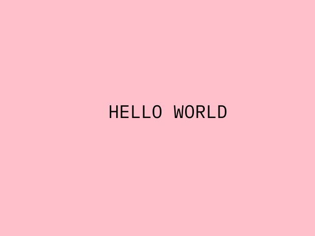
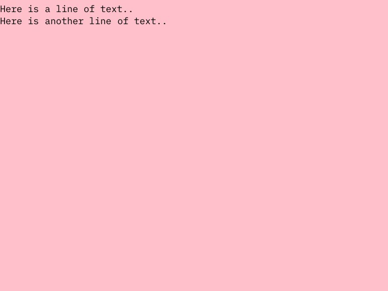
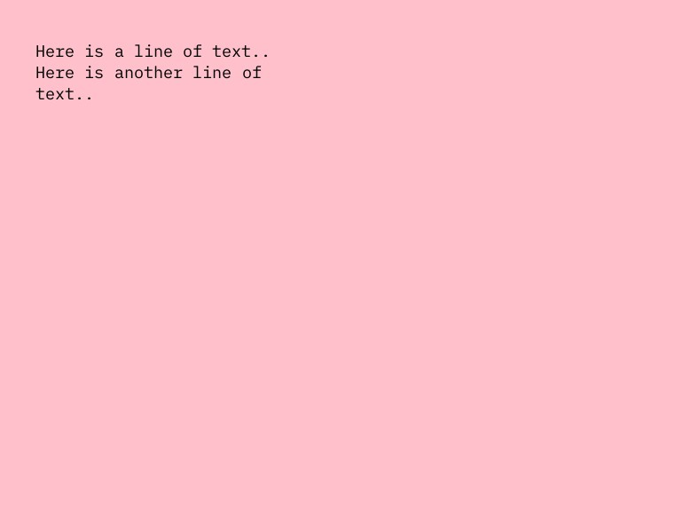

---
# File generated by dokgen. Do not edit. 
# Edit 'src/main/kotlin/docs/04_Drawing_basics/C120_Text.kt' instead.
layout: default
title: Text
parent: Drawing basics
last_modified_at: 2022.04.29 11:15:05 +0200
nav_order: 120
has_children: false
---
 
# Drawing text

OPENRNDR comes with support for rendering bitmap text. There are two modes of operation for writing text, a direct
mode that simply writes a string of text at the requested position, and a more advanced mode that can place texts 
in a designated text area. 
 
## Simple text rendering

To render simple texts we first make sure a font is loaded and assigned to `drawer.fontMap`, 
we then use [`drawer.text`](https://github.com/openrndr/openrndr/blob/v0.4.0-rc.7/openrndr-draw/src/commonMain/kotlin/org/openrndr/draw/Drawer.kt#L1200) to
draw the text. 
 
 
 
```kotlin
fun main() = application {
    program {
        val font = loadFont("data/fonts/default.otf", 48.0)
        extend {
            drawer.clear(ColorRGBa.PINK)
            drawer.fontMap = font
            drawer.fill = ColorRGBa.BLACK
            drawer.text("HELLO WORLD", width / 2.0 - 100.0, height / 2.0)
        }
    }
}
``` 
 
[Link to the full example](https://github.com/openrndr/openrndr-examples/blob/master/src/main/kotlin/examples/04_Drawing_basics/C120_Text000.kt) 
 
## Advanced text rendering

OPENRNDR comes with a 
[`Writer`](https://github.com/openrndr/openrndr/blob/v0.4.0-rc.7/openrndr-draw/src/commonMain/kotlin/org/openrndr/draw/Writer.kt#L22) 
class that allows for basic typesetting. The `Writer` tool is based 
on the concept of text box and a cursor.

Its use is easiest demonstrated through an example: 
 
 
 
```kotlin
fun main() = application {
    configure {
        width = 770
        height = 578
    }
    program {
        val font = loadFont("data/fonts/default.otf", 24.0)
        extend {
            drawer.clear(ColorRGBa.PINK)
            drawer.fontMap = font
            drawer.fill = ColorRGBa.BLACK
            
            writer {
                newLine()
                text("Here is a line of text..")
                newLine()
                text("Here is another line of text..")
            }
        }
    }
}
``` 
 
[Link to the full example](https://github.com/openrndr/openrndr-examples/blob/master/src/main/kotlin/examples/04_Drawing_basics/C120_Text001.kt) 
 
### Specifying the text area

The `box` field of `Writer` is used to specify where text should be written. Let's set the text area
to a 300 by 300 pixel rectangle starting at (40, 40).

We see that the text is now drawn with margins above and left of the text, and that the second line of
text is set on two rows. 
 
 
 
```kotlin
fun main() = application {
    configure {
        width = 770
        height = 578
    }
    program {
        val font = loadFont("data/fonts/default.otf", 24.0)
        extend {
            drawer.clear(ColorRGBa.PINK)
            drawer.fontMap = font
            drawer.fill = ColorRGBa.BLACK
            
            writer {
                box = Rectangle(40.0, 40.0, 300.0, 300.0)
                newLine()
                text("Here is a line of text..")
                newLine()
                text("Here is another line of text..")
            }
        }
    }
}
``` 
 
[Link to the full example](https://github.com/openrndr/openrndr-examples/blob/master/src/main/kotlin/examples/04_Drawing_basics/C120_Text002.kt) 
 
### Text properties

Text tracking -the horizontal space between characters- and leading -the vertical space between lines- can be
set using `Writer.style.leading` and `Writer.style.tracking`. 
 
<video controls preload="none" loop poster="../media/text-004-thumb.jpg">
    <source src="../media/text-004.mp4" type="video/mp4"></source>
</video>
 
 
```kotlin
fun main() = application {
    configure {
        width = 770
        height = 578
    }
    program {
        val font = loadFont("data/fonts/default.otf", 24.0)
        extend {
            drawer.clear(ColorRGBa.PINK)
            drawer.fontMap = font
            drawer.fill = ColorRGBa.BLACK
            
            writer {
                // -- animate the text leading
                leading = cos(seconds) * 20.0 + 24.0
                // -- animate the text tracking
                tracking = sin(seconds) * 20.0 + 24.0
                box = Rectangle(40.0, 40.0, width - 80.0, height - 80.0)
                newLine()
                text("Here is a line of text..")
                newLine()
                text("Here is another line of text..")
                newLine()
                text("Let's even throw another line of text in, for good measure! yay")
            }
        }
    }
}
``` 
 
[Link to the full example](https://github.com/openrndr/openrndr-examples/blob/master/src/main/kotlin/examples/04_Drawing_basics/C120_Text003.kt) 
