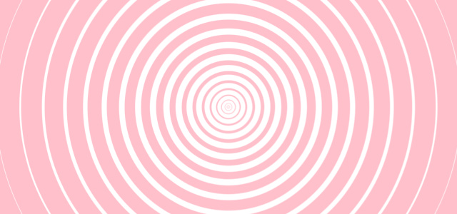
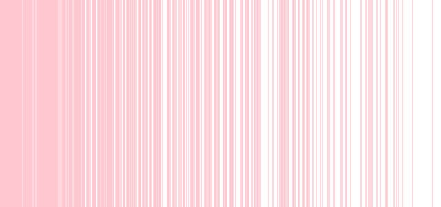
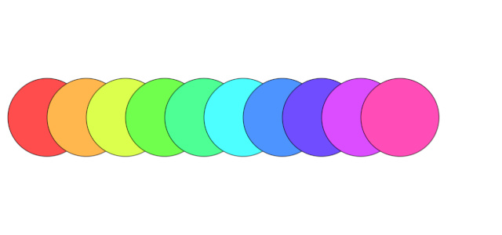

---
# File generated by dokgen. Do not edit. 
# Edit 'src/main/kotlin/docs/10_Kotlin_language_and_tools/C105_KotlinCollections.kt' instead.
layout: default
title: Kotlin collections
parent: Kotlin language and tools
last_modified_at: 2026.09.17 10:37:29 +0000
nav_order: 105
has_children: false
---
 
# Collection in Kotlin
    
The Collections in Kotlin's standard library are powerful tools 
for computational design and creative purposes.
It provides Lists, Maps and Sets with mutable and immutable variants.

Each of these data structures has many methods for querying and manipulating its elements,
which can then be made visible using OPENRNDR's drawing capabilities.

## List

A list is a collection of elements of the same type.
Let's see some immutable `List` examples: 
 
```kotlin
// Create an immutable list with specific Integers
val list = listOf(1, 2, 3, 5, 7)

// Accessing elements
println(list[0]) // 1
println(list.first()) // 1
println(list.last()) // 7

println(list.size) // 5
println(list.lastIndex) // 4
``` 
 
We can also create lists using the `List` constructor:     
 
```kotlin
// Generate a list of 10 random numbers
val randomNumbers = List(10) {
    Math.random().toInt()
}

// Generate a list of even numbers
val evenNumbers = List(10) {
    it * 2
}
``` 
 
Once we have a list, we can iterate over its elements:     
 
```kotlin
val list = listOf(1, 2, 3, 4, 5)
for (item in list) {
    println(item)
}
``` 
 
`forEach` and `forEachIndexed` can also be used 
to iterate over a list, although breaking 
out of the loop is not possible with them.     
 
```kotlin
val list = listOf(2, 7, 7, 1, 100)

list.forEach { println(it) }

list.forEachIndexed { index, item ->
    println("$index: $item")
}
``` 
 
Mutable lists behave mostly like immutable lists, but 
they can be modified:     
 
```kotlin
val mutableList = mutableListOf(1, 2, 3, 4, 5)
mutableList.add(6) // 1, 2, 3, 4, 5, 6
mutableList.remove(0) // 2, 3, 4, 5, 6
``` 
 
Lists provide many useful methods, such as `filter`, `map`, 
`sortedBy`, `groupBy`, `chunked`, and others. We will not
discuss them all in detail in this introduction, but 
here some examples: 
 
```kotlin
val list = List(16) { it } // Integers between 0 and 15
val evenNumbers = list.filter { it % 2 == 0 }
val squares = list.map { it * it }
val shuffled = list.shuffled()
val first5 = list.take(5)
val last5 = list.takeLast(5)
val asDouble = list.map { it.toDouble() }
``` 
 
## Visual examples
    
We haven't yet taken a look at any drawing operations, 
so don't worry if you don't yet fully understand how that
works, it will be introduced in next chapters.

These examples are just to give you a taste of how
lists can be used to create visual output.

Here's how to create and use a list with 20 double value: 
 
 
 
```kotlin
fun main() = application {
    program {
        // A list containing 1.0, 2.0, 5.0, 10.0, 17.0 ...
        val radii = List(20) { i -> 1.0 + i * i }
        extend {
            drawer.clear(ColorRGBa.WHITE)
            drawer.fill = null
            drawer.stroke = ColorRGBa.PINK
            // Go over each radius in the list and use it
            // for the stroke weight and the radius of a circle
            radii.forEach { radius ->
                drawer.strokeWeight = radius * 0.1
                drawer.circle(drawer.bounds.center, radius)
            }
        }
    }
}
``` 
 
[Link to the full example](https://github.com/openrndr/openrndr-examples/blob/master/src/main/kotlin/examples/10_Kotlin_language_and_tools/C105_KotlinCollections000.kt) 
 
And one final example populating a list of `Double`
values, then filtering out some items, and finally mapping
the remaining elements into `LineSegment` instances. 
 
 
 
```kotlin
fun main() = application {
    program {
        // Generate a list containing values between 0.0 and 1.0
        val x = List(width) { it.toDouble() / width }

        // Filter out high `x` values.
        // The condition is likely to be false for high `it` values, making them fail the test.
        val filtered = x.filter { Math.random() > it }

        // Map the lucky Double values to LineSegment instances.
        // `segs` is a `List<LineSegment>` and `it` is the current list element being processed (a double).
        val segs = filtered.map {
            LineSegment(it * width, 0.0, it * width, height.toDouble())
        }
        extend {
            drawer.clear(ColorRGBa.WHITE)
            drawer.stroke = ColorRGBa.PINK
            // Draw the line segments in our list
            drawer.lineSegments(segs)
        }
    }
}
``` 
 
[Link to the full example](https://github.com/openrndr/openrndr-examples/blob/master/src/main/kotlin/examples/10_Kotlin_language_and_tools/C105_KotlinCollections001.kt) 
 
## Map

Maps and Sets are arguably more niche data structures than lists,
but it's still worth mentioning them.

A map is a collection of key-value pairs, sometimes known as a dictionary.
There are two main constructors for maps: `mapOf()` and `mutableMapOf()`. 
 
```kotlin
// Create maps from integers to strings
val map = mapOf(1 to "one", 2 to "two", 3 to "three")
val mutableMap = mutableMapOf(1 to "one", 2 to "two", 3 to "three")

println(map[2]) // two
mutableMap[4] = "four" // add `4 to "four"` to the mutable map
mutableMap.remove(2) // remove a pair from the mutable map

// Create a map from a list of numbers to their squares
val squares = listOf(1, 3, 7).associateWith { it * it }
println(squares) // {1=1, 3=9, 7=49}
``` 
 
An example with a mutable map containing positions to colors. 
 
 
 
```kotlin
fun main() = application {
    program {
        // Notice how we can specify the key and value types
        val data = mutableMapOf<Vector2, ColorRGBa>()
        // Populate the map with 10 positions and colors
        repeat(10) {
            val pos = Vector2(60.0 + 50.0 * it, height * 0.5)
            val color = ColorHSVa(it * 36.0, 0.7, 1.0).toRGBa()
            data[pos] = color
        }
        extend {
            drawer.clear(ColorRGBa.WHITE)
            // Iterate over all the map items using the position and color of each
            data.forEach { (pos, c) ->
                drawer.fill = c
                drawer.circle(pos, 50.0)
            }
        }
    }
}
``` 
 
[Link to the full example](https://github.com/openrndr/openrndr-examples/blob/master/src/main/kotlin/examples/10_Kotlin_language_and_tools/C105_KotlinCollections002.kt) 
 
## Set

A set is a collection of *unique* elements.

There are two main constructors for sets:
`setOf()` and `mutableSetOf()`. 
 
```kotlin
// Immutable set
val s = setOf(1, 2, 3, 4, 5, 5, 5)
println(s) // [1, 2, 3, 4, 5]
println(s.contains(6)) // false

// Mutable set
val mutableS = mutableSetOf(1, 2, 3, 4, 5)
println(mutableS.add(6)) // true (added successfully)
println(mutableS.add(6)) // false (not added, already there)
println(mutableS.remove(3)) // true (removed successfully)
println(mutableS.remove(3)) // false (item does not exist)
``` 
 
One can also convert a list into a set to make sure
its elements are unique: 
 
```kotlin
val nonUnique = List(20) {
    (Math.random() * 10).toInt()
}
val unique = nonUnique.toSet()
println(nonUnique) // [4, 1, 4, 1, 0, 1, 4, 1, 1, 0]
println(unique) // [4, 1, 0]
``` 
 
There are endless possibilities with Lists, Sets, and Maps.
Learn more about them in the [Kotlin standard library documentation](https://kotlinlang.org/docs/collections-overview.html). 

[edit on GitHub](https://github.com/openrndr/openrndr-guide/blob/main/src/main/kotlin/docs/10_Kotlin_language_and_tools/C105_KotlinCollections.kt){: .btn .btn-github }